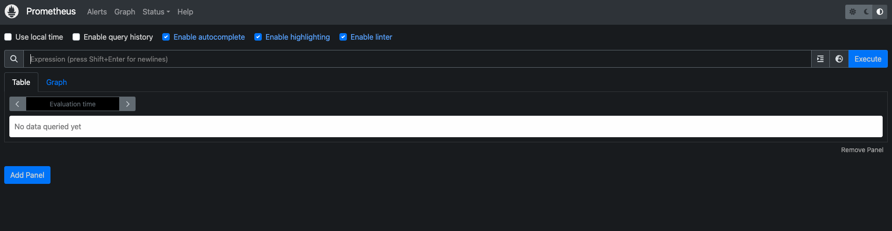
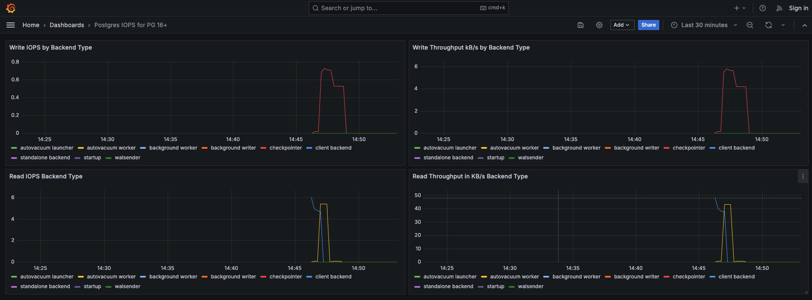

## Monitoring Postgres IOPS using Postgres 16+ pg_stat_io view

### Tools required:
- Orbstack[https://orbstack.dev] or Docker Desktop for running docker container locally
- Install Python 3+

### Steps to run:
- Setup python env to run python script
  - `python -m venv <venv_name>`
  - `source <venv_name>/bin/activate`
  - `pip3 install -r requirement.txt`
- Run `docker compose up`
  - Docker Compose - will spin up
    - Postgres container and create the DB with name `mydatabase`
    - Grafana container for the Visualization
    - Prometheus container for the Storing time series data and scraping
    - Prometheus postgres-exporter to compute postgres metrics
- Execute Python script to Create the table and insert `1000 rows per sec` in `mytable`
  - `python3 run bulk_insert.py`
- Setup the Postgres IOPS Dashboard
  - Open the Grafana Dashboard: http://localhost:9100/
  - Click on Dashboard, select Import option
  - Copy the dashboard json object from the grafana/provisioning/dashboards/pg-iops-dashboard.json, paste it and hit Save.
  - Voilla we have the Postgres IOPS Dashboard ready with us.
  - Wait for a couple of minutes for the data to starting coming on the Grafana Panels.

#### Metrics: http://0.0.0.0:9187/metrics

### Dashboard Links
- Grafana: http://localhost:9100/
- Prometheus: http://localhost:9090/

### Screenshots

